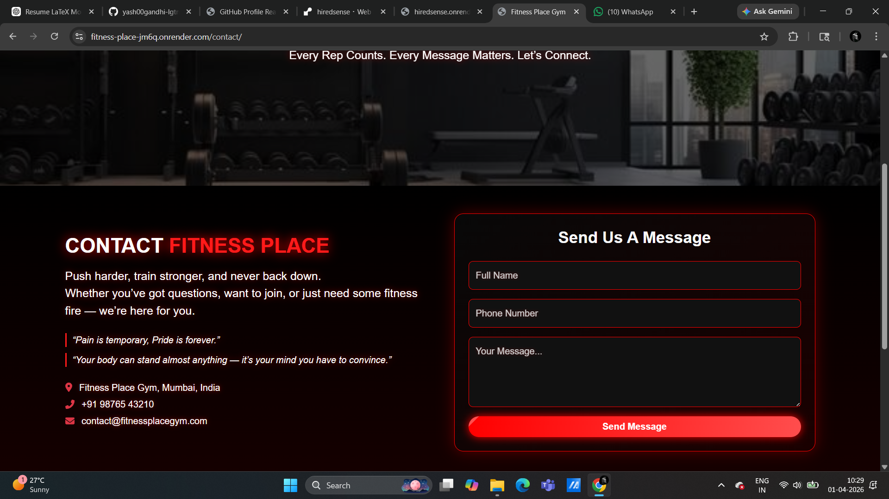
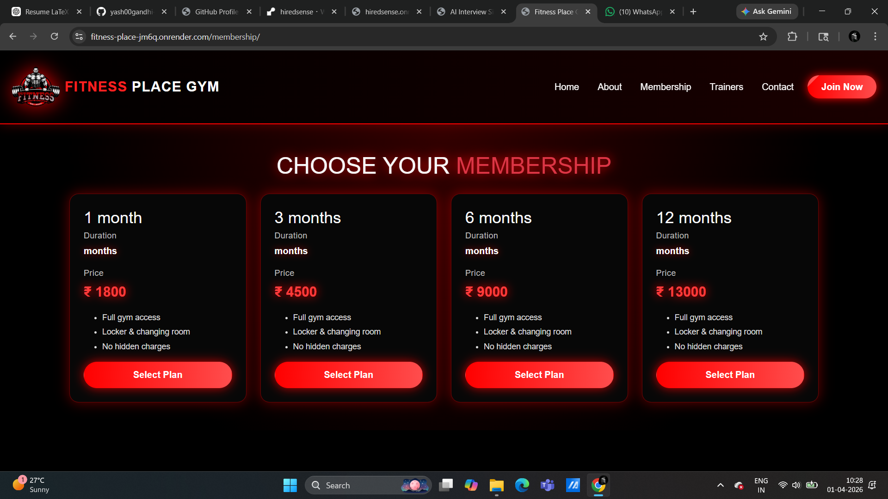
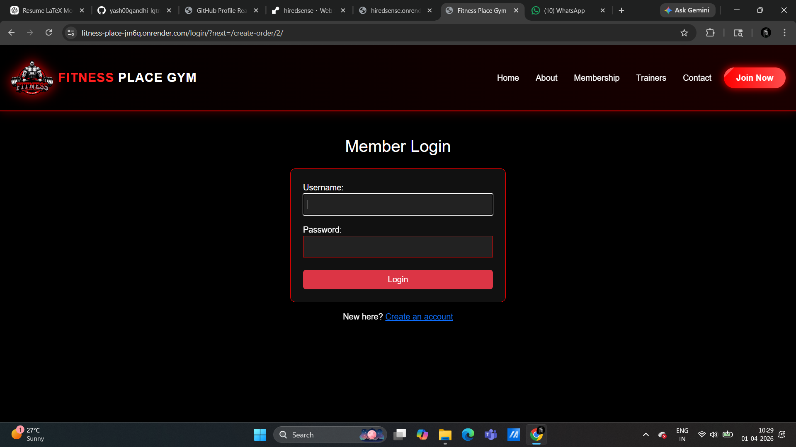

# Gym Management & Payment Backend System

A backend-driven gym management platform built using Django and Django REST Framework.
The system is designed as a reusable product for gym owners with secure authentication,
payment integration, and invoice generation.

## Features
- Secure user authentication (JWT-based)
- Login-protected access
- Razorpay payment gateway integration
- Invoice generation after successful payment
- RESTful APIs for gym-related operations
- Deployed on Render

## Tech Stack
- Python
- Django
- Django REST Framework
- MySQL (Production) / SQLite (Development)
- JWT Authentication
- Razorpay
- Git & GitHub

## Deployment
The application is deployed on Render and is production-ready for core features such as
authentication, payments, and invoice generation.

## Future Improvements
- Trainer module enhancements
- Improved role-based access control
- UI and performance optimizations

## 📸 Screenshots

### Dashboard

  

### Member Management

  

### Subscription System

  

